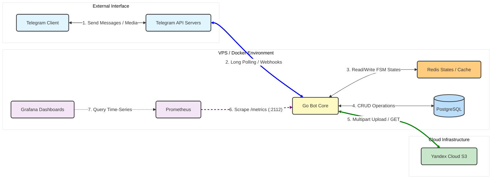
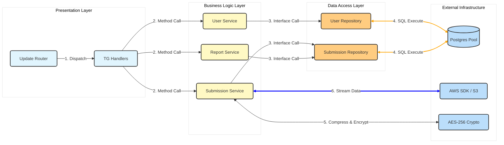
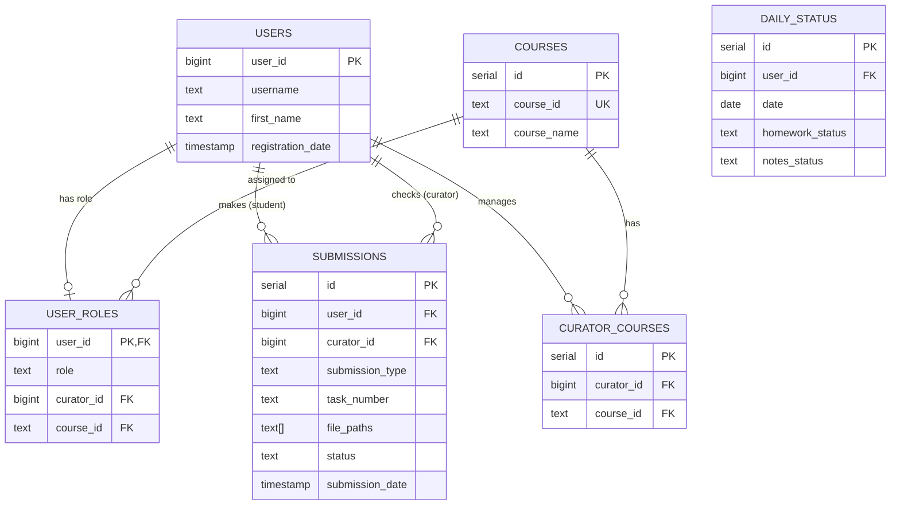

# Educational Telegram Bot (HighLoad Architecture)


>[!IMPORTANT]
> Современный, отказоустойчивый Telegram-бот для образовательной платформы. Бот обеспечивает управление учениками, 
> распределение кураторов, сдачу домашних заданий и генерацию аналитических отчетов.
> Среднее время ответа ядра: ~0.008 ms. Система спроектирована с учетом высоких нагрузок, 
> безопасного хранения файлов (AES-шифрование) и горизонтального масштабирования.

## Архитектура



> Инфраструктура бота спроектирована с упором на отказоустойчивость, высокую производительность и готовность к 
масштабированию. Все компоненты упакованы в Docker-контейнеры для предсказуемого развертывания на любом VPS.

### Узлы системы

- Core: Благодаря легковесным горутинам (Goroutines), бот способен асинхронно обрабатывать тысячи одновременных запросов(Long Polling) от Telegram API с минимальным потреблением CPU и RAM.
- Redis: Сверхбыстрое in-memory хранилище. Используется для управления машиной состояний (FSM) пользователей. Хранение промежуточных шагов (например, навигация по меню) в Redis полностью снимает паразитную нагрузку с основной базы данных.
- Postgres: Надежное персистентное хранилище. Обеспечивает ACID-транзакции и строгую ссылочную целостность (Foreign Keys) для критически важных данных: профили учеников, курсы, связи с кураторами и статистика сдач.
- S3: Внешнее объектное хранилище. Полностью решает проблему исчерпания дискового пространства на сервере (I/O Bottleneck). Файлы и архивы не сохраняются локально, а напрямую стримятся в облако.
- Observability Stack: Prometheus раз в несколько секунд собирает метрики (число запросов, потребление памяти, время ответа БД) с эндпоинта /metrics, а Grafana визуализирует их на дашбордах для контроля за здоровьем системы в реальном времени.

## Чистая Архитектура



> Кодовая база проекта строго структурирована по принципам Чистой архитектуры. Главная цель такого подхода – полная изоляция 
бизнес-логики от внешних инструментов (фреймворков, Telegram API, баз данных). Зависимости направлены строго внутрь: от интерфейсов к ядру.

### Слои
- Presentation Layer: слой взаимодействия с пользователем. Router принимает апдейты от Telegram и направляет их в нужные Handlers. Хендлеры занимаются только парсингом команд и отрисовкой кнопок, они ничего не знают о том, как сохраняются файлы или где лежат данные.
- Business Logic Layer: ядро приложения (UserService, SubmissionService, ReportService). Здесь описаны все бизнес-правила платформы: проверки ролей, логика прикрепления к кураторам, сборка аналитики и пайплайны обработки файлов.
- Data Access Layer: слой абстракции над данными. Реализует паттерн Repository. Сервисы общаются с базой данных исключительно через строгие Go-интерфейсы, не привязываясь к конкретным SQL-запросам.
- External Infrastructure: низкоуровневые реализации — пул соединений PostgreSQL (pgxpool), клиент S3 (aws-sdk-go-v2) и модуль криптографии (AES-256).

## Поток обработки данных

```mermaid
%%{init: {
  'theme': 'base',
  'themeVariables': {
    'primaryColor': '#fff',
    'primaryBorderColor': '#333',
    'lineColor': '#333',
    'fontFamily': 'arial',
    'fontSize': '14px'
  }
}}%%

graph LR

    classDef user fill:#e1f5fe,stroke:#333,stroke-width:2px,rx:5,ry:5;
    classDef bot fill:#fff9c4,stroke:#333,stroke-width:2px,rx:5,ry:5;
    classDef proc fill:#ffcc80,stroke:#333,stroke-width:2px,rx:5,ry:5;
    classDef cloud fill:#c8e6c9,stroke:#333,stroke-width:2px,rx:5,ry:5;
    classDef db fill:#bbdefb,stroke:#333,stroke-width:2px,rx:5,ry:5;

    Student[User / Student]:::user
    TG[TG Download Link]:::user
    Stream[io.Reader Stream]:::proc
    Crypto[AES Stream Encryptor]:::proc
    S3[Yandex S3 Storage]:::cloud
    DB[(PostgreSQL)]:::db

    Student -- "1. Upload Photo/Doc" --> TG
    TG -- "2. GET HTTP Stream" --> Stream
    Stream -- "3. On-the-fly Compress" --> Crypto
    Crypto -- "4. Multipart S3 Upload" --> S3
    
    S3 -- "5. Return S3 Key" --> Bot[Bot Core]:::bot
    Bot -- "6. Insert Path (TEXT[])" --> DB
    Bot -- "7. Send Success Msg" --> Student

    linkStyle 1 stroke-width:3px,fill:none,stroke:blue;
    linkStyle 3 stroke-width:3px,fill:none,stroke:green;
    linkStyle 4 stroke-width:2px,fill:none,stroke:orange;
```



>Обработка вложений (фотографий, архивов, документов) – самое узкое место (bottleneck) в любом Telegram-боте. 
> Если загружать файлы целиком в оперативную память (через io.ReadAll), при наплыве из 50-100 юзеров сервер неминуемо 
> упадет из-за нехватки ОЗУ (OOM Killer).В данном проекте реализован I/O Streaming Pipeline, который решает эту проблему элегантно и эффективно.

### Как работает

- Инициализация: ученик отправляет файл, бот получает ссылку на скачивание от API Telegram.
- Открытие потока: бот открывает HTTP-поток (создает интерфейс io.Reader), начиная читать байты напрямую с серверов Telegram без сохранения на жесткий диск VPS.
- Обработка на лету : байты проходят через цепочку фильтров (io.Pipe). Сначала данные на лету сжимаются (Compress), а затем сразу шифруются алгоритмом AES-256. В памяти одновременно находится только небольшой чанк данных в несколько килобайт.
- Multipart Upload: зашифрованный поток напрямую перенаправляется в Yandex Cloud S3. Загрузка идет по частям (Multipart), что позволяет безлимитно грузить файлы любого размера.
- Транзакция в БД: после успешной загрузки S3 возвращает уникальный ключ файла. Бот делает молниеносный INSERT в PostgreSQL, сохраняя путь в поле типа TEXT[] (массив строк).
- Уведомление: только после этого студент получает галочку об успешной сдаче.

## Архитектура базы данных



> База данных спроектирована на базе PostgreSQL с жестким соблюдением принципов нормализации и ссылочной целостности 
> (ACID). Структура таблиц отражает четкое разделение между аутентификацией (профили Telegram) и бизнес-логикой 
> образовательной платформы (курсы, проверки, статистика).

### Архитектурные решения и оптимизации

- Гибкая ролевая модель (RBAC): Разделение базовой информации о пользователе (`USERS`) и его системного статуса (`USER_ROLES`). Это позволяет пользователю бесшовно менять роли (например, ученик стал куратором) без дублирования учетных записей или потери истории.
- M:N: Таблица `CURATOR_COURSES` выступает в роли транзитного (junction) узла. Она позволяет одному куратору вести сразу несколько различных курсов, а администратору – гибко балансировать нагрузку (распределять учеников) между наставниками одного направления.
- Денормализация для скорости: Вместо создания отдельной таблицы `FILES` для хранения каждой фотографии или документа, пути к объектам в S3-хранилище записываются прямо в массив `file_paths` (нативный тип данных PostgreSQL TEXT[]) таблицы `SUBMISSIONS`. Это избавляет систему от тяжелых JOIN-ов при выборке сдач и кратно ускоряет отдачу данных при формировании Excel-отчетов.
- Ссылочная целостность: Все критичные связи защищены внешними ключами. Это гарантирует отсутствие «осиротевших» данных – например, система на уровне СУБД не позволит записать домашнюю работу на удаленного ученика или привязать студента к несуществующему курсу.
- Готовность к аналитике: Отдельная таблица `DAILY_STATUS` спроектирована как лог состояний. Она позволяет моментально за $O(1)$ получать срез активности ученика за любой день без необходимости каждый раз пересчитывать агрегации по всей таблице сдач.

## Временная шкала обработки файлов

```mermaid
gantt
    title Временная шкала потоковой обработки тяжелого файла (Streaming Pipeline)
    dateFormat HH:mm:ss
    axisFormat %S.%L s

    section Telegram API
    Прием апдейта (Файл)       :done, t1, 00:00:00, 50ms
    Запрос ссылки на скачивание:active, t2, after t1, 150ms

    section Стриминг (I/O)
    TCP чтение потока из TG    :crit, t3, after t2, 2000ms
    Сжатие (GZIP) на лету      :t4, after t2, 2000ms
    AES-256 Шифрование         :t5, after t2, 2000ms
    Multipart загрузка в S3    :active, t6, after t2, 2100ms

    section PostgreSQL
    Сохранение S3 Key в БД     :done, t7, after t6, 20ms

    section Уведомления
    Статус "Успешно" ученику   :t8, after t7, 100ms
    Алерт о сдаче куратору     :t9, after t7, 100ms
```



>В классическом подходе бот сначала скачивал бы весь файл в память, затем тратил время на его сжатие,
> потом на шифрование, и только после этого начинал загрузку в облако. Это приводило бы к огромным задержкам и риску падения сервера.

### Как работает по все по этапам

- $O(1)$ Memory Footprint: Независимо от того, весит файл 5 мб или 2 гб, потребление оперативной памяти остается неизменным (всего несколько мегабайт на буферы стриминга).
- Минимальный Latency: Устранение простоев между этапами `скачал -> подождал -> сжал -> подождал` сокращает время ответа бота на 40-60% по сравнению с синхронной обработкой.

## S3 bucket

> Для хранения пользовательских файлов (документов, изображений, архивов) используется S3-совместимое объектное хранилище. 
Все файлы перед отправкой проходят AES-256 шифрование, поэтому в облаке они хранятся в виде бинарного потока (.bin.enc).

```text
bucket_name/
  ├── year/                               <-- ID курса (year / half_year)
  │     ├── name_curator/             <-- Никнейм или имя куратора
  │     │     ├── student_name/                <-- Никнейм или имя студента
  │     │     │     ├── Task_1/           <-- Номер задания
  │     │     │     │     ├── 550e8400_photo1.jpg.bin.enc  <-- 8-символьный UUID + Имя + Encrypted
  │     │     │     │     └── 9b2a1f4c_doc.pdf.bin.enc
  │     │     │     └── Task_24/          
  │     │     └── student_2/              
  │     └── curator_2/                    
  └── three_month/
```

## Запуск

> [!IMPORTANT]
> **Docker**
> *Запуск*
> ```shell
> make dc-up
> ```
> *Удаление докер-контейнеров* 
> ```shell
> make dc-down
> ```


```shell
docker exec -i telegram_bot_senya-postgres-1 psql -U postgres -d telegram_bot -c "
UPDATE user_roles
SET role = 'admin'
WHERE user_id =8548162447;
"
```

```shell
docker exec -it telegram_bot_senya-postgres-1 psql -U postgres -d telegram_bot -c "                                                                                                                     
SELECT *          
FROM users;                              
"
```